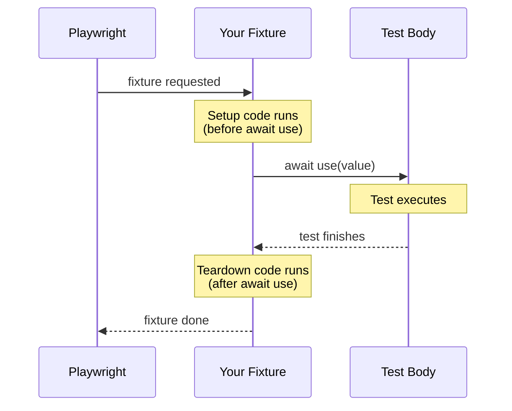
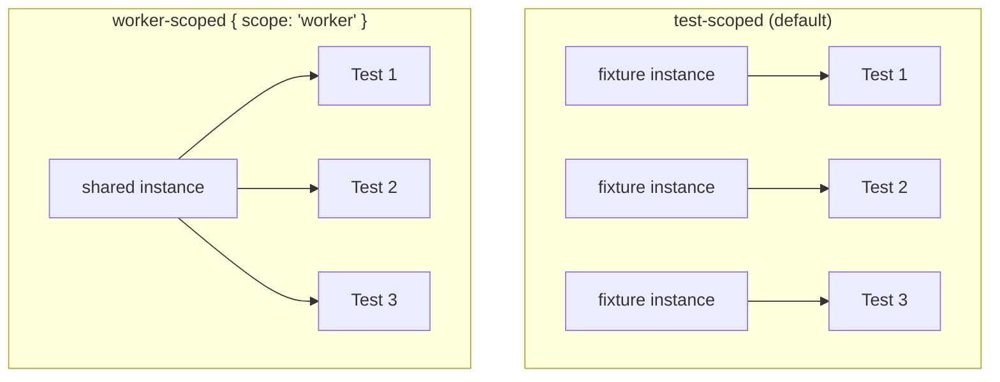

# Fixtures

> **Source**: All patterns in this section are sourced directly from the [official Playwright fixtures documentation](https://playwright.dev/docs/test-fixtures) and the [authentication guide](https://playwright.dev/docs/auth). Where something goes beyond what Playwright documents, it is labeled as a **pattern** or **architectural decision**.

---

## What Fixtures Are

From the [official docs](https://playwright.dev/docs/test-fixtures):

> "Playwright Test is based on the concept of test fixtures. Test fixtures establish the environment for each test, giving the test everything it needs and nothing else."

Fixtures are Playwright's replacement for `beforeEach`/`afterAll` hooks. The key differences:

| Hooks | Fixtures |
|-------|----------|
| Defined inside `describe` blocks | Defined once, reused across files |
| Setup and teardown are separate functions | Setup and teardown live in the same function |
| Always run, even if the test doesn't need them | Lazy — only initialized when a test requests them |
| Shared via closure or outer scope | Explicitly declared as dependencies |

---

## Built-In Fixtures

Playwright ships five fixtures you can use in any test without setup:

| Fixture | Type | Scope | What it gives you |
|---------|------|-------|-------------------|
| `page` | `Page` | Test | A new browser page, isolated per test |
| `context` | `BrowserContext` | Test | The browser context containing the page |
| `browser` | `Browser` | Worker | The browser instance, shared across tests in a worker |
| `browserName` | `string` | Worker | The name of the current browser (`chromium`, `firefox`, `webkit`) |
| `request` | `APIRequestContext` | Test | An isolated API request context per test |

You get these automatically — no import needed beyond `{ test } from '@playwright/test'`.

---

## Fixture Lifecycle

The `use()` call is the boundary between setup and teardown. Everything before it is setup; everything after it is teardown.

```typescript
import { test as base } from '@playwright/test';

export const test = base.extend({
  todoPage: async ({ page }, use) => {
    // SETUP — runs before the test
    const todoPage = new TodoPage(page);
    await todoPage.goto();

    // Hand the fixture to the test
    await use(todoPage);

    // TEARDOWN — runs after the test, even if the test fails
    await todoPage.removeAll();
  },
});
```

The fixture receives its own dependencies as the first argument (here, `page`). Any built-in or custom fixture can be requested this way.



---

## Test Scope vs Worker Scope

This is the most important concept to understand when building auth fixtures.

### Test-scoped (default)

A test-scoped fixture is created fresh for each test and torn down immediately after.

```typescript
export const test = base.extend({
  // No scope specified = test scope
  myPage: async ({ page }, use) => {
    await page.goto('/dashboard');
    await use(page);
  },
});
```

Every test that requests `myPage` gets its own isolated page.

### Worker-scoped

A worker-scoped fixture is created once per worker process and shared across every test running in that worker.

```typescript
// Note the second type parameter — worker fixtures are typed separately
export const test = base.extend<{}, { account: Account }>({
  account: [async ({ browser }, use, workerInfo) => {
    // Runs ONCE per worker, not once per test
    const username = 'user' + workerInfo.workerIndex;
    const password = 'verysecure';

    const page = await browser.newPage();
    await page.goto('/signup');
    await page.getByLabel('User Name').fill(username);
    await page.getByLabel('Password').fill(password);
    await page.getByText('Sign up').click();
    await page.close();

    await use({ username, password });

    // Teardown runs when the worker process ends
  }, { scope: 'worker' }],
});
```

The key difference in syntax: the fixture is written as a **tuple** — `[async function, { scope: 'worker' }]`. Without `{ scope: 'worker' }`, it is test-scoped.

### Which scope to choose

| Situation | Scope |
|-----------|-------|
| Page navigation or state that should be clean for each test | Test |
| Login / authentication (expensive, safe to share across tests in a worker) | Worker |
| Database seed data shared across a worker | Worker |
| Any state that a test modifies and that could affect another test | Test |



Each box in the test-scoped row is a **separate** fixture instance — created fresh, torn down after each test. The worker-scoped row shares **one** instance across all tests in the worker.

---

## Fixture Dependency Chain

Fixtures can depend on other fixtures. Playwright resolves the dependency order automatically.

```typescript
export const test = base.extend({
  // adminPage depends on browser (built-in)
  adminPage: async ({ browser }, use) => {
    const context = await browser.newContext({
      storageState: 'playwright/.auth/admin.json',
    });
    const page = await context.newPage();
    await use(page);
    await context.close(); // teardown
  },
});
```

Setup order follows dependencies: built-in → custom base fixtures → fixtures that depend on them.
Teardown order is the reverse.

---

## Automatic Fixtures

An automatic fixture runs for every test whether the test declares it or not. Useful for setup that should always happen — logging, screenshots on failure, network stubs.

```typescript
export const test = base.extend({
  screenshotOnFailure: [async ({ page }, use, testInfo) => {
    await use(); // no value to provide — this fixture exists for its side effects

    if (testInfo.status !== testInfo.expectedStatus) {
      await page.screenshot({
        path: `test-results/failure-${testInfo.title}.png`,
      });
    }
  }, { auto: true }], // runs for every test automatically
});
```

---

## Overriding Built-In Fixtures

You can replace a built-in fixture with a custom version. The most common use: navigating to a base URL before every test.

```typescript
export const test = base.extend({
  // Override the built-in 'page' fixture
  page: async ({ baseURL, page }, use) => {
    await page.goto(baseURL!);
    await use(page); // tests receive a page already at the base URL
  },
});
```

---

## Fixture Options

Fixtures can expose configurable parameters so different projects in `playwright.config.ts` can use the same fixture with different values.

```typescript
// Define the option type and the fixture together
export type MyOptions = {
  defaultItem: string;
};

export const test = base.extend<MyOptions & { todoPage: TodoPage }>({
  // The default value goes in the array, with { option: true }
  defaultItem: ['Buy milk', { option: true }],

  todoPage: async ({ page, defaultItem }, use) => {
    const todoPage = new TodoPage(page);
    await todoPage.goto();
    await todoPage.addToDo(defaultItem);
    await use(todoPage);
  },
});
```

Configure per project in `playwright.config.ts`:

```typescript
export default defineConfig<MyOptions>({
  projects: [
    {
      name: 'shopping',
      use: { defaultItem: 'Buy groceries' },
    },
    {
      name: 'work',
      use: { defaultItem: 'Finish report' },
    },
  ],
});
```

---

## Combining Fixtures from Multiple Files

When a fixture file grows large, split it. Use `mergeTests` to combine:

```typescript
import { mergeTests } from '@playwright/test';
import { test as authTest } from './fixtures/auth';
import { test as apiTest } from './fixtures/api';

export const test = mergeTests(authTest, apiTest);
```

Tests can then request fixtures from both sources through a single import.

---

## Authentication Fixture — Two Patterns

Auth fixtures are where scope decisions matter most. Playwright documents two approaches.

### Pattern 1: Setup project (recommended for most cases)

A dedicated setup project runs `auth.setup.ts` before any tests. All tests then inherit the saved session via `storageState`.

```typescript
// playwright.config.ts
export default defineConfig({
  projects: [
    { name: 'setup', testMatch: /.*\.setup\.ts/ },
    {
      name: 'chromium',
      use: {
        storageState: 'playwright/.auth/user.json',
      },
      dependencies: ['setup'],
    },
  ],
});
```

```typescript
// auth.setup.ts
import { test as setup, expect } from '@playwright/test';

const authFile = 'playwright/.auth/user.json';

setup('authenticate', async ({ page }) => {
  await page.goto('/login');
  await page.getByLabel('Username').fill(process.env.USERNAME!);
  await page.getByLabel('Password').fill(process.env.PASSWORD!);
  await page.getByRole('button', { name: 'Sign in' }).click();
  await page.waitForURL('/dashboard');
  await page.context().storageState({ path: authFile });
});
```

Tests need nothing special — the `page` fixture is already authenticated:

```typescript
import { test, expect } from '@playwright/test';

test('dashboard loads', async ({ page }) => {
  // page is already authenticated via storageState
  await expect(page.getByRole('heading', { name: 'Dashboard' })).toBeVisible();
});
```

### Pattern 2: Worker-scoped fixture (one account per parallel worker)

Use when tests modify server-side state and parallel workers would interfere with each other.

```typescript
// fixtures/auth.ts
import { test as baseTest, expect } from '@playwright/test';
import fs from 'fs';
import path from 'path';

export * from '@playwright/test';

export const test = baseTest.extend<{}, { workerStorageState: string }>({
  // Override storageState using the worker fixture
  storageState: ({ workerStorageState }, use) => use(workerStorageState),

  workerStorageState: [async ({ browser }, use) => {
    const id = test.info().parallelIndex;
    const fileName = path.resolve(
      test.info().project.outputDir,
      `.auth/${id}.json`
    );

    if (fs.existsSync(fileName)) {
      await use(fileName);
      return;
    }

    const page = await browser.newPage({ storageState: undefined });
    await page.goto('/login');
    await page.getByLabel('Username').fill(`user_${id}@example.com`);
    await page.getByLabel('Password').fill(process.env.PASSWORD!);
    await page.getByRole('button', { name: 'Sign in' }).click();
    await page.waitForURL('/dashboard');

    await page.context().storageState({ path: fileName });
    await page.close();

    await use(fileName);
  }, { scope: 'worker' }],
});
```

---

## Manual Worker Cache Pattern

> **Architectural decision** — not from official Playwright docs. This is a pattern used when you want worker-like behavior without `{ scope: 'worker' }`, typically to share a live `Page` object across tests in a serial block.

Instead of saving `storageState` to a file and reloading it, this pattern keeps the logged-in `Page` object in a module-level `Map` keyed by `workerIndex`.

```typescript
// fixtures/auth.ts
import { test as base, Page, BrowserContext } from '@playwright/test';

type AuthFixtures = { loggedInPage: Page };

const workerCache = new Map<number, Page>();

export const test = base.extend<AuthFixtures>({
  loggedInPage: async ({ browser }, use, testInfo) => {
    const workerIndex = testInfo.workerIndex;

    if (workerCache.has(workerIndex)) {
      await use(workerCache.get(workerIndex)!);
      return;
    }

    // Fresh login
    const context = await browser.newContext();
    const page = await context.newPage();
    await page.goto('/login');
    await page.getByLabel('Username').fill(process.env.USERNAME!);
    await page.getByLabel('Password').fill(process.env.PASSWORD!);
    await page.getByRole('button', { name: 'Sign in' }).click();
    await page.waitForURL('/dashboard');

    workerCache.set(workerIndex, page);
    await use(page);
  },
});
```

### How it works

The `workerCache` Map is module-level, so it persists for the lifetime of the Node.js process (the worker). The first test in a worker populates the cache. Every subsequent test in the same worker receives the same `Page` object — no re-login needed.

### Trade-offs vs the official worker-scoped fixture

| | Manual cache pattern | Official `{ scope: 'worker' }` |
|---|---|---|
| Manages setup/teardown | You manage it (via `workerCache`) | Playwright manages it |
| Teardown code location | No teardown after `use()` — page is never explicitly closed | Teardown runs after `use()` when worker ends |
| Reuses live `Page` object | Yes — same page instance | No — each test gets a fresh page with loaded `storageState` |
| Works well with `test.describe.serial` | Yes — tests share page state intentionally | Depends on the fixture design |
| Works well with fully parallel tests | Risky — shared page state means one test's actions affect the next | Safe — each test gets an isolated page |

**When the manual cache is appropriate**: test suites that use `test.describe.serial` and intentionally chain state across tests (e.g., add to cart in test 1, verify cart in test 2). The shared `Page` preserves browser state between the serial steps.

**When to prefer the official worker-scoped pattern**: fully parallel tests where each test must start from a clean, authenticated state.

---

## Common Mistakes

### Not awaiting `use()`

```typescript
// Wrong — teardown never runs
loggedInPage: async ({ browser }, use) => {
  const page = await browser.newPage();
  use(page); // missing await
},
```

```typescript
// Correct
loggedInPage: async ({ browser }, use) => {
  const page = await browser.newPage();
  await use(page); // teardown runs after this resolves
},
```

### Putting cleanup before `use()`

```typescript
// Wrong — cleanup runs before the test, not after
myFixture: async ({ page }, use) => {
  await page.goto('/reset');  // this runs before the test
  await use(page);
},
```

Cleanup always goes **after** `await use()`.

### Importing `test` from `@playwright/test` instead of your custom fixture file

```typescript
// Wrong — your custom loggedInPage fixture is not available
import { test } from '@playwright/test';

test('checkout', async ({ loggedInPage }) => { ... });
```

```typescript
// Correct — import from the file that defines your extended test
import { test } from '../fixtures/auth';

test('checkout', async ({ loggedInPage }) => { ... });
```

This is a silent failure — Playwright will complain that `loggedInPage` is not a known fixture.
