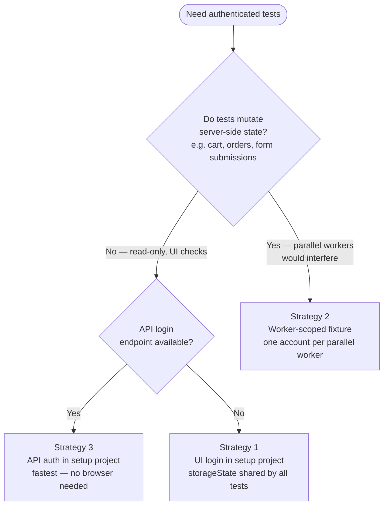

# Authentication

> **Source**: All patterns in this section are sourced directly from the [official Playwright authentication documentation](https://playwright.dev/docs/auth). Where something goes beyond what Playwright documents, it is labeled as a **note** or **architectural decision**.

---

## Why Authentication Needs Its Own Strategy

Playwright creates isolated browser contexts for every test. That isolation is the source of test reliability — one test cannot leak cookies or localStorage into another. But it also means that without a strategy, every test that needs a logged-in user will run the login flow from scratch.

At scale, that is slow and fragile: slow because UI login flows involve network round-trips and page rendering, and fragile because login pages and auth providers are some of the most frequently changing parts of a system.

The goal of an auth strategy is to authenticate **once per scope** (once per suite run, or once per worker) and reuse the saved browser state for every test that needs it.

---

## The `playwright/.auth` Directory

Before writing any auth code, create this directory and add it to `.gitignore`.

```bash
mkdir -p playwright/.auth
echo "\nplaywright/.auth" >> .gitignore
```

From the [official docs](https://playwright.dev/docs/auth):

> "Browser state file may contain sensitive cookies and headers that could be used to impersonate you or your test account."

The `storageState` file saved by Playwright contains cookies and `localStorage` entries for a logged-in session. Committing it to version control is a security risk — treat it the same as a `.env` file containing passwords.

**`.gitignore` entry:**

```
playwright/.auth
```

---

## Keeping Credentials Out of Source Code

> **Architectural decision** — Playwright's docs show credentials inline in examples for brevity. In real projects, credentials must come from environment variables.

Store credentials in a `.env` file (never committed), and access them at runtime:

```
# .env  — add to .gitignore
APP_URL=https://your-app.com
TEST_USERNAME=test_user@example.com
TEST_PASSWORD=supersecret
```

```typescript
// utils/config.ts
import dotenv from 'dotenv';
dotenv.config();

function requireEnv(name: string): string {
  const value = process.env[name];
  if (!value) throw new Error(`Missing required env var: ${name}`);
  return value;
}

export const appConfig = {
  url: requireEnv('APP_URL'),
  getUsername: () => requireEnv('TEST_USERNAME'),
  getPassword: () => requireEnv('TEST_PASSWORD'),
};
```

Provide a committed `.env.example` with placeholder values so teammates know what variables are needed:

```
# .env.example — committed to version control
APP_URL=https://your-app.com
TEST_USERNAME=
TEST_PASSWORD=
```

In CI, inject these as environment secrets rather than files.

---

## Strategy 1 — Setup Project (Recommended for Most Suites)

This is the strategy the official docs recommend first. A dedicated `setup` project runs before all other projects, authenticates once, and saves the session to a file. Every test then starts with that session loaded automatically.

**Best for**: Suites where tests do not modify server-side state that would interfere with each other (read-heavy tests, UI validation, content checks).

### Step 1 — Create the auth setup file

```typescript
// auth.setup.ts
import { test as setup, expect } from '@playwright/test';
import path from 'path';

const authFile = path.join(__dirname, '../playwright/.auth/user.json');

setup('authenticate', async ({ page }) => {
  await page.goto('/login');
  await page.getByLabel('Username').fill(process.env.TEST_USERNAME!);
  await page.getByLabel('Password').fill(process.env.TEST_PASSWORD!);
  await page.getByRole('button', { name: 'Sign in' }).click();

  // Wait for navigation to confirm login succeeded
  await page.waitForURL('/dashboard');

  // Save session state to file
  await page.context().storageState({ path: authFile });
});
```

### Step 2 — Wire up the config

```typescript
// playwright.config.ts
import { defineConfig, devices } from '@playwright/test';

export default defineConfig({
  projects: [
    // Runs first, produces the auth file
    {
      name: 'setup',
      testMatch: /.*\.setup\.ts/,
    },

    // All other projects depend on setup and load the auth file automatically
    {
      name: 'chromium',
      use: {
        ...devices['Desktop Chrome'],
        storageState: 'playwright/.auth/user.json',
      },
      dependencies: ['setup'],
    },
    {
      name: 'firefox',
      use: {
        ...devices['Desktop Firefox'],
        storageState: 'playwright/.auth/user.json',
      },
      dependencies: ['setup'],
    },
  ],
});
```

### Step 3 — Write tests with no login code

```typescript
// any-test.spec.ts
import { test, expect } from '@playwright/test';

test('dashboard displays user name', async ({ page }) => {
  // page is already authenticated — no login code needed
  await page.goto('/dashboard');
  await expect(page.getByRole('heading', { name: 'Welcome' })).toBeVisible();
});
```

The `storageState` in the project config is applied to every `page` fixture automatically. Tests import from `@playwright/test` directly — no custom fixture needed.

---

## Strategy 2 — Worker-Scoped Fixture (One Account Per Parallel Worker)

**Best for**: Suites where tests write data, modify cart state, create orders, or change anything on the server. If two parallel workers share one account and both add items to the same cart, tests will interfere with each other.

Each worker authenticates once with its own account, identified by `parallelIndex`.

```typescript
// playwright/fixtures.ts
import { test as baseTest, expect } from '@playwright/test';
import fs from 'fs';
import path from 'path';

export * from '@playwright/test';

export const test = baseTest.extend<{}, { workerStorageState: string }>({
  // Override the built-in storageState using the worker fixture
  storageState: ({ workerStorageState }, use) => use(workerStorageState),

  workerStorageState: [async ({ browser }, use) => {
    const id = test.info().parallelIndex;
    const fileName = path.resolve(
      test.info().project.outputDir,
      `.auth/${id}.json`
    );

    // Reuse existing auth file for this worker if it exists
    if (fs.existsSync(fileName)) {
      await use(fileName);
      return;
    }

    // Authenticate with the account assigned to this worker index
    const page = await browser.newPage({ storageState: undefined });
    await page.goto('/login');
    await page.getByLabel('Username').fill(`user_${id}@example.com`);
    await page.getByLabel('Password').fill(process.env.TEST_PASSWORD!);
    await page.getByRole('button', { name: 'Sign in' }).click();
    await page.waitForURL('/dashboard');

    await page.context().storageState({ path: fileName });
    await page.close();

    await use(fileName);
  }, { scope: 'worker' }],
});
```

```typescript
// example.spec.ts
import { test, expect } from '../playwright/fixtures';

test('add item to cart', async ({ page }) => {
  // page is authenticated as the account for this worker
  await page.goto('/products');
  await page.getByRole('button', { name: 'Add to cart' }).first().click();
  await expect(page.getByTestId('cart-badge')).toHaveText('1');
});
```

### Key details

- `{ scope: 'worker' }` means the fixture runs once per worker process, not once per test
- `storageState: undefined` on `browser.newPage()` prevents the page from inheriting the project-level `storageState` during the login step — you want a fresh, unauthenticated context to perform the login
- `parallelIndex` (not `workerIndex`) is used for the file name — it is the index within the parallel execution range (0 to `workers - 1`), which maps cleanly to a pool of test accounts
- This requires a pool of real test accounts in your test environment, one per parallel worker

---

## Strategy 3 — API Authentication (Faster Than UI Login)

When the application has an API login endpoint, use it instead of the UI. API requests are significantly faster than navigating a login page.

```typescript
// auth.setup.ts
import { test as setup } from '@playwright/test';

const authFile = 'playwright/.auth/user.json';

setup('authenticate via API', async ({ request }) => {
  await request.post('/api/login', {
    data: {
      username: process.env.TEST_USERNAME,
      password: process.env.TEST_PASSWORD,
    },
  });

  // storageState on the request context saves cookies set by the API response
  await request.storageState({ path: authFile });
});
```

The `request` fixture is Playwright's built-in API request context. Cookies set in an API response are saved to the state file exactly the same way as cookies set during a browser login.

---

## Multiple Roles — Admin and User

When tests require different permission levels, create a separate auth file per role and a separate setup step for each.

```typescript
// auth.setup.ts
import { test as setup, expect } from '@playwright/test';

const adminFile = 'playwright/.auth/admin.json';
const userFile = 'playwright/.auth/user.json';

setup('authenticate as admin', async ({ page }) => {
  await page.goto('/login');
  await page.getByLabel('Username').fill(process.env.ADMIN_USERNAME!);
  await page.getByLabel('Password').fill(process.env.ADMIN_PASSWORD!);
  await page.getByRole('button', { name: 'Sign in' }).click();
  await page.waitForURL('/admin/dashboard');
  await page.context().storageState({ path: adminFile });
});

setup('authenticate as user', async ({ page }) => {
  await page.goto('/login');
  await page.getByLabel('Username').fill(process.env.USER_USERNAME!);
  await page.getByLabel('Password').fill(process.env.USER_PASSWORD!);
  await page.getByRole('button', { name: 'Sign in' }).click();
  await page.waitForURL('/dashboard');
  await page.context().storageState({ path: userFile });
});
```

Use `test.use()` to switch roles within a spec file:

```typescript
// admin.spec.ts
import { test, expect } from '@playwright/test';

// All tests in this file use the admin session
test.use({ storageState: 'playwright/.auth/admin.json' });

test('admin can delete users', async ({ page }) => {
  await page.goto('/admin/users');
  await expect(page.getByRole('button', { name: 'Delete' })).toBeVisible();
});
```

```typescript
// mixed-roles.spec.ts
import { test, expect } from '@playwright/test';

// Default role for this file
test.use({ storageState: 'playwright/.auth/user.json' });

test('user cannot access admin panel', async ({ page }) => {
  await page.goto('/admin');
  await expect(page).toHaveURL('/login');
});

// Override for a specific block
test.describe('admin actions', () => {
  test.use({ storageState: 'playwright/.auth/admin.json' });

  test('admin can view reports', async ({ page }) => {
    await page.goto('/admin/reports');
    await expect(page.getByRole('heading', { name: 'Reports' })).toBeVisible();
  });
});
```

---

## Testing Two Roles in One Test

When a single test needs to act as both admin and user simultaneously — for example, testing that an admin's action is visible to a regular user — create two separate browser contexts.

```typescript
// collaboration.spec.ts
import { test, expect } from '@playwright/test';

test('admin message is visible to user', async ({ browser }) => {
  const adminContext = await browser.newContext({
    storageState: 'playwright/.auth/admin.json',
  });
  const adminPage = await adminContext.newPage();

  const userContext = await browser.newContext({
    storageState: 'playwright/.auth/user.json',
  });
  const userPage = await userContext.newPage();

  await adminPage.goto('/messages/new');
  await adminPage.getByLabel('Message').fill('Hello from admin');
  await adminPage.getByRole('button', { name: 'Send' }).click();

  await userPage.goto('/messages');
  await expect(userPage.getByText('Hello from admin')).toBeVisible();

  await adminContext.close();
  await userContext.close();
});
```

### With POM fixtures

For cleaner tests, wrap each role in a fixture:

```typescript
// fixtures/roles.ts
import { test as base } from '@playwright/test';
import { AdminPage } from '../pages/admin/admin.actions';
import { UserPage } from '../pages/user/user.actions';

type RoleFixtures = {
  adminPage: AdminPage;
  userPage: UserPage;
};

export * from '@playwright/test';

export const test = base.extend<RoleFixtures>({
  adminPage: async ({ browser }, use) => {
    const context = await browser.newContext({
      storageState: 'playwright/.auth/admin.json',
    });
    await use(new AdminPage(await context.newPage()));
    await context.close();
  },

  userPage: async ({ browser }, use) => {
    const context = await browser.newContext({
      storageState: 'playwright/.auth/user.json',
    });
    await use(new UserPage(await context.newPage()));
    await context.close();
  },
});
```

```typescript
// collaboration.spec.ts
import { test, expect } from '../fixtures/roles';

test('admin message visible to user', async ({ adminPage, userPage }) => {
  await adminPage.sendMessage('Hello from admin');
  await expect(userPage.greeting).toHaveText('Hello from admin');
});
```

---

## Session Storage

`storageState` captures cookies and `localStorage`. It does **not** capture `sessionStorage`, which only persists within a single page load.

If your app stores auth tokens in `sessionStorage`, save and restore it separately:

```typescript
// Save sessionStorage after login
const sessionStorage = await page.evaluate(() =>
  JSON.stringify(sessionStorage)
);
fs.writeFileSync('playwright/.auth/session.json', sessionStorage, 'utf-8');
```

```typescript
// Restore sessionStorage before tests
const sessionStorage = JSON.parse(
  fs.readFileSync('playwright/.auth/session.json', 'utf-8')
);

await context.addInitScript(storage => {
  if (window.location.hostname === 'your-app.com') {
    for (const [key, value] of Object.entries(storage))
      window.sessionStorage.setItem(key, value as string);
  }
}, sessionStorage);
```

---

## Bypassing Auth for Specific Tests

If a test explicitly tests the unauthenticated state (login page, redirect behavior, error messages for logged-out users), reset `storageState` to empty:

```typescript
// unauthenticated.spec.ts
import { test, expect } from '@playwright/test';

// This overrides the project-level storageState for all tests in this file
test.use({ storageState: { cookies: [], origins: [] } });

test('redirects to login when not authenticated', async ({ page }) => {
  await page.goto('/dashboard');
  await expect(page).toHaveURL('/login');
});
```

---

## Choosing a Strategy

| Situation | Strategy |
|-----------|----------|
| Tests only read data, no server-side modifications | Setup project (Strategy 1) |
| Tests write data and parallel workers would interfere | Worker-scoped fixture (Strategy 2) |
| API login endpoint available | API auth in setup (Strategy 3) |
| Tests need multiple roles | Separate auth files + `test.use()` |
| One test needs both roles at once | Two browser contexts in the test |
| Specific tests must be unauthenticated | `test.use({ storageState: { cookies: [], origins: [] } })` |


