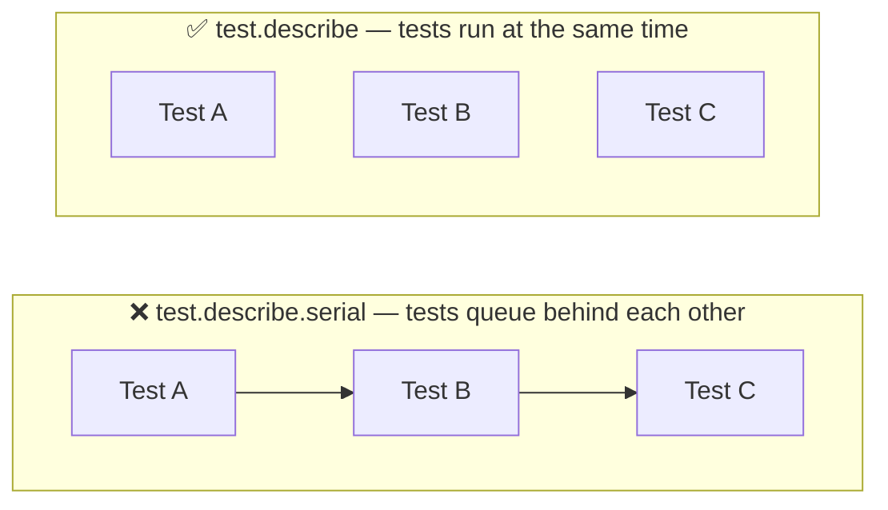

# Anti-Patterns

> Concrete before/after examples drawn from real Playwright frameworks, with the official Playwright recommendation for each. Sources are linked per section.

---

## 1. XPath When a Semantic Locator Exists

**Source**: [playwright.dev/docs/best-practices](https://playwright.dev/docs/best-practices) — "Prefer user-facing attributes to XPath or CSS selectors."

```typescript
// ❌ XPath tied to the DOM attribute — breaks if the id is renamed or
//    generated dynamically (React, Angular, Vue apps often do this)
this.usernameField = page.locator('//*[@id="user-name"]');
```

```typescript
// ✅ Role + label — tests what the user actually sees
this.usernameField = page.getByLabel('Username');

// ✅ If the input has no label, a data-test attribute is more stable than an id
this.usernameField = page.getByTestId('user-name'); // requires testIdAttribute config
```

**Why it matters**: IDs are frequently changed by developers or generated by frameworks. `getByLabel` survives a rename because it targets the user-visible label, not the implementation attribute. If the label text changes, that is itself a meaningful change — the test should catch it.

See [docs/03-locators](../03-locators/README.md) for the full priority order.

---

## 2. CSS Class Selectors for Interactive Elements

**Source**: [playwright.dev/docs/best-practices](https://playwright.dev/docs/best-practices) — "Avoid: `page.locator('button.buttonIcon.episode-actions-later')`."

```typescript
// ❌ CSS class — breaks when a designer renames or restructures classes
this.cartIcon = page.locator('.shopping_cart_link');
```

```typescript
// ✅ Role-based — survives CSS refactors
this.cartIcon = page.getByRole('link', { name: 'Shopping cart' });

// ✅ data-test attribute — explicit testing contract, no dependency on styling
this.cartIcon = page.getByTestId('shopping-cart-link');
```

**Why it matters**: Class names are styling concerns. A designer can rename `.shopping_cart_link` to `.cart-nav-link` without changing any visible or functional behaviour — but the test breaks. The fix is to target what the user or the testing contract defines, not how the element is styled.

---

## 3. `waitForTimeout` Inside Page Objects

**Source**: [playwright.dev/docs/best-practices](https://playwright.dev/docs/best-practices) and [docs/08-flaky-tests](../08-flaky-tests/README.md).

```typescript
// ❌ Hard wait — adds 200ms to every addItemToCart call,
//    still fails on slow CI if the DOM update takes longer
async addItemToCart(productName: string) {
  const addButton = this.getProductByName(productName)
    .locator('button[data-test^="add-to-cart-"]')
    .first();
  await addButton.click();
  await this.page.waitForTimeout(200); // ← remove this
}
```

```typescript
// ✅ Assert the outcome of the action — the assertion waits automatically
async addItemToCart(productName: string) {
  const product = this.getProductByName(productName);
  const addButton = product.locator('button[data-test^="add-to-cart-"]').first();
  await addButton.click();
  // If the caller needs to verify the cart updated, they assert on the badge.
  // The page object should not hard-wait for an outcome it cannot know.
}
```

**Why it matters**: `waitForTimeout(200)` assumes the DOM update always takes less than 200 ms. On a slow CI runner it may take 800 ms — and the test that calls `getCartBadgeCount()` next will read a stale value. The correct approach is to assert the expected outcome directly, using a web-first assertion that polls until true.

**The deeper issue**: page objects should perform actions, not bake in timing assumptions. If callers need to know the cart updated, they assert on the badge count — not on a sleep.

---

## 4. `waitForSelector` Instead of a Web-First Assertion

**Source**: [playwright.dev/docs/best-practices](https://playwright.dev/docs/best-practices).

```typescript
// ❌ waitForSelector is a one-shot check with no retry context
async getVisibleProductNames(): Promise<string[]> {
  await this.page.waitForSelector('[data-test="inventory-item"]');
  return this.locators.inventoryItemNames.allInnerTexts();
}
```

```typescript
// ✅ A web-first assertion retries until the condition is true
async getVisibleProductNames(): Promise<string[]> {
  await expect(this.locators.inventoryItems.first()).toBeVisible();
  return this.locators.inventoryItemNames.allInnerTexts();
}
```

**Why it matters**: `waitForSelector` does wait — but it is resolved by a single DOM presence check and gives you a raw `ElementHandle`. Once it resolves, the locator operations that follow get no further retry protection. `expect(locator).toBeVisible()` uses Playwright's full polling engine and integrates with the configured `expect.timeout`. If the element disappears after the selector resolves but before `allInnerTexts()` runs, `waitForSelector` gives you no protection.

---

## 5. `.isVisible()` and `.textContent()` Inside Assertions

**Source**: [playwright.dev/docs/best-practices](https://playwright.dev/docs/best-practices) — explicitly called out as a mistake.

```typescript
// ❌ .isVisible() resolves immediately — no waiting
expect(await page.getByTestId('title').isVisible()).toBe(true);

// ❌ .textContent() resolves immediately — no waiting
expect(await page.getByTestId('title').textContent()).toBe('Your Cart');
```

```typescript
// ✅ Web-first assertions poll until the condition is true
await expect(page.getByTestId('title')).toBeVisible();
await expect(page.getByTestId('title')).toHaveText('Your Cart');
```

**Why it matters**: `.isVisible()` and `.textContent()` are regular async methods — they take a snapshot of the DOM at the moment they are called and return. If the element has not rendered yet, `.isVisible()` returns `false` and the assertion fails. The `await` is in the wrong position. Web-first assertions (`toBeVisible`, `toHaveText`, `toHaveURL`, etc.) poll up to the configured `expect.timeout`. This single change eliminates the most common form of flakiness.

See the full comparison table in [docs/08-flaky-tests](../08-flaky-tests/README.md#cause-2--wrong-await-placement-the-isvisible-trap).

---

## 6. `any` Type on Playwright's `Page`

```typescript
// ❌ Loses all TypeScript safety — no autocomplete, no type errors
const getPages = (page: any) => ({
  product: new ProductsPage(page),
  cart: new CartPage(page),
  checkout: new CheckoutPage(page),
});
```

```typescript
// ✅ Typed correctly — TypeScript checks every page object call
import { Page } from '@playwright/test';

const getPages = (page: Page) => ({
  product: new ProductsPage(page),
  cart: new CartPage(page),
  checkout: new CheckoutPage(page),
});
```

**Why it matters**: `Page` is fully typed in `@playwright/test`. Using `any` silences TypeScript across everything that flows from that parameter — if a page object method is renamed or its signature changes, the compiler will not catch it. One import and one type annotation restores full safety.

---

## 7. HTML Reporter `autoopen` Option

**Source**: [playwright.dev/docs/test-reporters](https://playwright.dev/docs/test-reporters).

```typescript
// ❌ 'autoopen' is not a recognised option — it is silently ignored
reporter: [['html', { autoopen: false }]],
```

```typescript
// ✅ The correct option is 'open'
reporter: [['html', { open: 'never' }]],
```

Valid values for `open`: `'always'` | `'never'` | `'on-failure'`.

**Why it matters**: With `autoopen: false` silently ignored, the HTML reporter falls back to its default behaviour, which is `open: 'on-failure'` — the browser opens after a failed run. On CI this either errors or hangs. The correct option has been `open` since Playwright's reporter API was defined.

---

## 8. No Teardown in the Login Fixture

```typescript
// ❌ Pages stored in workerCache are never explicitly closed
const workerCache = new Map<number, Page>();

export const test = base.extend<AuthFixtures>({
  loggedInPage: async ({ browser }, use, testInfo) => {
    // ...
    workerCache.set(workerIndex, page);
    await use(page);
    // nothing after use() — page and context are never closed
  },
});
```

```typescript
// ✅ Teardown after use() closes the context when the worker finishes
export const test = base.extend<AuthFixtures>({
  loggedInPage: async ({ browser }, use, testInfo) => {
    const workerIndex = testInfo.workerIndex;

    if (workerCache.has(workerIndex)) {
      await use(workerCache.get(workerIndex)!);
      return;
    }

    const context = await browser.newContext();
    const page = await context.newPage();
    // ... login ...
    workerCache.set(workerIndex, page);

    await use(page);

    // Teardown — runs when the worker process ends
    await context.close();
  },
});
```

**Why it matters**: Without teardown, the browser context for each worker is left open until the OS reclaims the process. For short test runs this is invisible. For long-running CI jobs or suites with many workers it leaks memory and browser processes. Placing `context.close()` after `await use()` ensures cleanup happens when Playwright's worker lifecycle ends.

See also the official [worker-scoped fixture pattern](../02-fixtures/README.md#pattern-2--worker-scoped-fixture-one-account-per-parallel-worker) which handles this correctly using `{ scope: 'worker' }`.

---

## 9. Repeated `waitForLoadState` Calls

```typescript
// ❌ waitForLoadState called redundantly before and after actions
await page.goto(`${appConfig.url}/inventory.html`, { waitUntil: 'domcontentloaded' });
await page.waitForLoadState('domcontentloaded'); // duplicate — goto already waited

await login.login(username, password);
await page.waitForLoadState('domcontentloaded'); // login() click already auto-waits

const titleElement = page.locator('[data-test="title"]');
await titleElement.waitFor({ state: 'visible', timeout: 10000 });
await page.waitForLoadState('domcontentloaded'); // redundant after waitFor
```

```typescript
// ✅ Let auto-waiting and a single web-first assertion do the work
await page.goto(`${appConfig.url}/inventory.html`);
await login.login(username, password);
await expect(page.locator('[data-test="title"]')).toBeVisible();
```

**Why it matters**: `page.goto()` with `waitUntil: 'domcontentloaded'` already waits for the load event — calling `waitForLoadState` immediately after duplicates the wait. Actions like `click()` have built-in auto-waiting. Stacking `waitForLoadState` + `waitFor` + `waitForLoadState` after a single interaction adds seconds to every test without adding reliability — the final `expect` assertion provides all the stability needed.

---

## 10. `testInfo.setTimeout` Hardcoded in a Fixture

```typescript
// ❌ Hardcoded timeout inside the fixture overrides the config globally
export const test = base.extend<AuthFixtures>({
  loggedInPage: async ({ browser }, use, testInfo) => {
    testInfo.setTimeout(60000); // silently overrides playwright.config.ts timeout
    // ...
  },
});
```

```typescript
// ✅ Set the timeout where it belongs — in playwright.config.ts
// playwright.config.ts
export default defineConfig({
  timeout: 30000,       // test timeout
  use: {
    navigationTimeout: 30000,
  },
});
```

If a specific fixture genuinely needs a longer budget (e.g. a slow login against a staging environment), set it explicitly and visibly at the project level:

```typescript
// playwright.config.ts
projects: [
  {
    name: 'staging',
    timeout: 60000, // documented, visible, scoped to this project
  },
],
```

**Why it matters**: `testInfo.setTimeout()` inside a fixture changes the timeout for every test that uses that fixture — silently, with no record in the config file. Developers reading the config will not see it. Putting timeouts in `playwright.config.ts` keeps the full picture visible in one place.

---

## 11. `console.log` Statements in Fixtures and Tests

```typescript
// ❌ Logs left in production test code
if (workerCache.has(workerIndex)) {
  console.log(`[Worker ${workerIndex}] Reusing cached logged-in page`);
  // ...
}
console.log(`[${browserName}] Performing fresh login`);
console.log(`[${browserName}] New session saved at:`, sessionFile);
```

```typescript
// ✅ Use testInfo.annotations or Playwright's built-in step API for visibility
test.step('authenticate', async () => {
  // Playwright logs this step in the HTML report and trace automatically
  await login.login(username, password);
});
```

**Why it matters**: `console.log` output in fixtures appears in CI logs for every test — it is noise that makes real failures harder to find. It also adds I/O overhead in parallel runs. Playwright's built-in `test.step()` and the trace viewer provide better visibility into what a fixture is doing, without polluting stdout.

---

## 12. `test.describe.serial` Without a Real Dependency

```typescript
// ❌ serial used as a default — prevents parallel execution
//    even for tests that could run independently
test.describe.serial('Product page', () => {
  test('should display products', async ({ loggedInPage }) => { /* ... */ });
  test('should sort products', async ({ loggedInPage }) => { /* ... */ });
  test('should add item to cart', async ({ loggedInPage }) => { /* ... */ });
});
```

```typescript
// ✅ If the tests are independent, remove serial
test.describe('Product page', () => {
  test('should display products', async ({ loggedInPage }) => { /* independent */ });
  test('should sort products', async ({ loggedInPage }) => { /* independent */ });
  test('should add item to cart', async ({ loggedInPage }) => { /* independent */ });
});

// ✅ Reserve serial for tests that genuinely chain state
test.describe.serial('Checkout flow', () => {
  test('should add item to cart', async ({ loggedInPage }) => { /* modifies state */ });
  test('should view cart', async ({ loggedInPage }) => { /* depends on above */ });
  test('should complete checkout', async ({ loggedInPage }) => { /* depends on above */ });
});
```



**Why it matters**: `test.describe.serial` prevents parallel execution for the entire block. With `fullyParallel: true`, serial blocks become bottlenecks. Use it only when each test in the block intentionally depends on state left by the previous test. If tests are independent — each starting from a clean fixture — they can and should run in parallel.

---

## 13. Over-Abstraction: Enterprise Patterns on a Small Project

```typescript
// ❌ Split locator/action POM applied to a three-file test suite
//    Two files to maintain per page, for a suite one developer owns.

// pages/login/login.locators.ts
export class LoginLocators {
  readonly usernameField = this.page.getByTestId('user-name');
  readonly passwordField = this.page.getByTestId('password');
  readonly loginButton = this.page.getByTestId('login-button');
  constructor(private page: Page) {}
}

// pages/login/login.actions.ts
export class LoginPage {
  private readonly locators: LoginLocators;
  constructor(private page: Page) {
    this.locators = new LoginLocators(page);
  }
  async login(username: string, password: string) {
    await this.locators.usernameField.fill(username);
    await this.locators.passwordField.fill(password);
    await this.locators.loginButton.click();
  }
}
```

```typescript
// ✅ Simple POM — locators as private properties, actions as public methods.
//    One file per page. Refactor to the split only if you feel the split's pain.

// pages/LoginPage.ts
export class LoginPage {
  readonly page: Page;
  private readonly usernameInput: Locator;
  private readonly passwordInput: Locator;
  private readonly loginButton: Locator;

  constructor(page: Page) {
    this.page = page;
    this.usernameInput = page.getByTestId('username');
    this.passwordInput = page.getByTestId('password');
    this.loginButton = page.getByTestId('login-button');
  }

  async login(username: string, password: string) {
    await this.usernameInput.fill(username);
    await this.passwordInput.fill(password);
    await this.loginButton.click();
  }
}
```

**Why it matters**: The split locator/action pattern solves a real problem — it separates UI changes from business logic changes so that different teams can work on them independently. On a small project, that problem does not exist. Applying the pattern before you feel the pain violates YAGNI and introduces extra files, extra imports, and extra cognitive overhead for no benefit.

**The right trigger**: adopt the split when you can point to a specific recurring problem it would solve: locator changes and action changes arriving in separate PRs from different people, or a linting rule that enforces the separation. If you can't name the problem, use a single-class POM.

See the [framework architecture guide](../01-framework-architecture/README.md) for the full progression from scripts → simple POM → split POM.

---

## Quick Reference

| Anti-pattern | Fix | Section |
|---|---|---|
| `page.locator('//*[@id="..."]')` | `page.getByLabel()` or `page.getByTestId()` | [Locators](../03-locators/README.md) |
| `page.locator('.css-class')` for interactive elements | `page.getByRole()` or `page.getByTestId()` | [Locators](../03-locators/README.md) |
| `await page.waitForTimeout(n)` | Remove — rely on auto-waiting or use `expect` | [Flaky Tests](../08-flaky-tests/README.md) |
| `await page.waitForSelector(...)` | `await expect(locator).toBeVisible()` | [Flaky Tests](../08-flaky-tests/README.md) |
| `expect(await locator.isVisible()).toBe(true)` | `await expect(locator).toBeVisible()` | [Flaky Tests](../08-flaky-tests/README.md) |
| `page: any` | `page: Page` from `@playwright/test` | — |
| `{ autoopen: false }` in HTML reporter | `{ open: 'never' }` | [Configuration](../05-configuration/README.md) |
| No teardown after `await use()` | `await context.close()` after `use()` | [Fixtures](../02-fixtures/README.md) |
| `waitForLoadState` after every action | Remove — use one `expect` assertion | [Flaky Tests](../08-flaky-tests/README.md) |
| `testInfo.setTimeout()` in fixture | Set `timeout` in `playwright.config.ts` | [Configuration](../05-configuration/README.md) |
| `console.log` in fixtures | `test.step()` or remove | — |
| `test.describe.serial` by default | Use only for genuinely chained state | [Fixtures](../02-fixtures/README.md) |
| Split locator/action POM on a small project | Single-class POM until you feel the split's specific pain | [Framework Architecture](../01-framework-architecture/README.md) |
